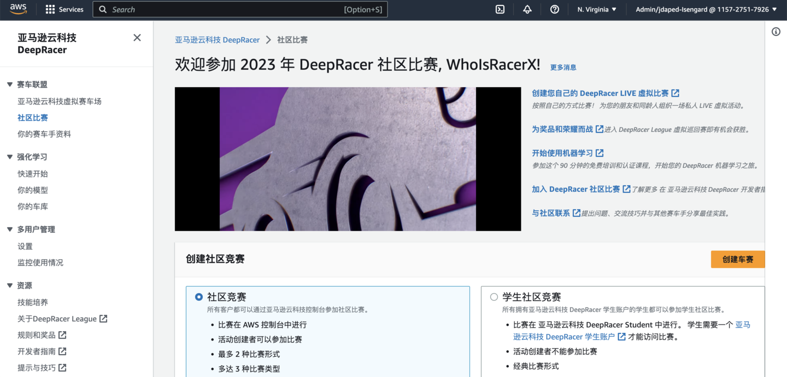

# deepracer-chinese

**Last Tested:** 2023-02-27

**Supported Browsers:**
- Google Chrome

## What is this? 

A Tampermonkey script to translate the DeepRacer console into Chinese

## What does it do?

This script translates the AWS DeepRacer console into simplified Chinese. 

## How do I use it? 

1. Install the [Tampermonkey](https://www.tampermonkey.net/) browser extension
2. Visit [this link](https://jeremypedersen.com/resources/tampermonkey/SimplifiedChineseDeepRacer.user.js) to fetch the latest version of the translation tool (Tampermonkey will prompt you to install the script)

That's it! 

## What is the result? 

A DeepRacer console that looks like this:

